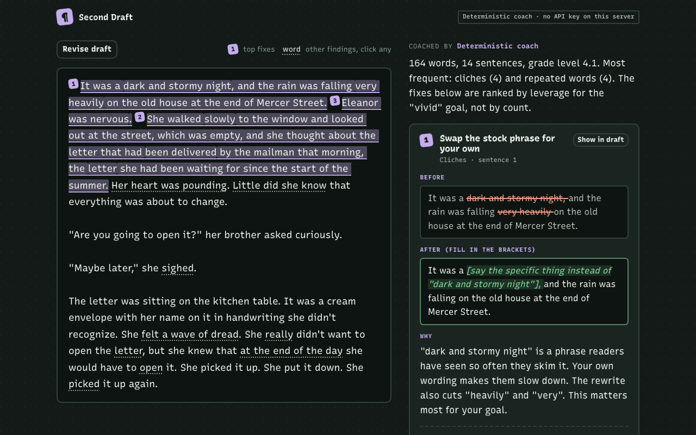

# Second Draft

A writing coach that points at exact sentences. Paste a draft (up to 3,000 words), pick a goal, and get the three fixes that would change the piece most. Each fix quotes a sentence you wrote, shows a before and after, explains why it matters, and gives you a short exercise. Revise, run it again, and watch the numbers move.



## How it works

The rule is deterministic below, probabilistic above. Code measures the text. A model, when there is one, only decides what matters and explains it.

1. **Tools measure.** Eleven pure detectors find facts with character offsets: passive voice, filler and hedges, adverbs, cliches (a list of 163 patterns), repeated words, dialogue tags, named emotions, sentence rhythm, paragraph shape, the opening line, and dense sentences. Sentence splitting handles abbreviations ("Dr.", "e.g."), initials, decimals, ellipses and dialogue. Metrics include Flesch-Kincaid grade level and a sentence length histogram.
2. **The coach ranks.** Without an API key, a deterministic coach groups findings by sentence and ranks them by a leverage score: `goal weight x severity x opening bonus x direct-fix bonus`, plus a share of the other findings in the same sentence. The weights are in `src/coach/deterministic.ts`, and every card shows its own arithmetic. Rewrites are built by code (active voice, cuts, sentence splits, dialogue beats). When a fix needs the writer's knowledge, the "after" keeps a bracketed prompt and is labeled as a scaffold.
3. **With a key, an agent coaches.** A tool-use loop gives Claude (`claude-haiku-4-5` by default, through the Anthropic Messages API) or an OpenAI model (function calling) five tools: `analyze_draft`, `get_findings`, `get_sentences`, `compare_drafts` and `submit_coaching`. The loop has a turn limit, a token budget and a timeout. Any failure falls back to the deterministic coach and says so on the page.
4. **Every citation is checked.** The validator only accepts an item if `sentence_index` names a real sentence and the quote appears verbatim inside it. Offsets are computed from the draft, never taken from the model. A rewrite that does not change the text is rejected. Failed items get one repair turn and are then dropped. If fewer than three survive, deterministic items fill the gap and are labeled as such.

The page renders the draft with inline highlights (click any for details), the three fix cards, a metrics panel with bars across your drafts, a progress list, and the trace of tool calls. Drafts are kept in your browser's `localStorage`; if storage is blocked the page still works and says it cannot remember drafts.

## Run it

Needs Node 22.

```bash
npm install
npm run build
npm start             # http://localhost:3000
```

For development, `npm run dev` rebuilds the browser bundle once and restarts the server on changes.

With no API key the app runs the deterministic coach, which is the default demo. To try the agent, start it with a key:

```bash
ANTHROPIC_API_KEY=sk-ant-... npm start
# or
OPENAI_API_KEY=sk-... npm start
```

The live-model path is tested only against mocked HTTP responses. See [PROOF.md](PROOF.md).

## Commands

| Command | What it does |
|---|---|
| `npm test` | 99 tests (vitest): splitting, every detector, rewrites, validator, the mocked tool-use loop for both providers, server limits, browser helpers |
| `npm run eval` | per-detector precision and recall on 25 labeled synthetic passages, and the validator against 887 planted bad citations |
| `npm run eval -- --errors` | the same, plus every false positive and false negative |
| `npm run typecheck` | TypeScript over source, tests, evals and scripts |
| `npm run screenshots` | Playwright screenshots of the production build into `docs/screenshots` |

## API

- `GET /health` returns `{ ok, model }`.
- `GET /api/config` says whether a model is configured and lists the goals.
- `POST /api/coach` with `{ draft, goal?, previousDraft?, useModel? }`. Goals: `balanced`, `tighter`, `vivid`, `clearer`, `voice`. Returns the items, the full analysis, a metric comparison when `previousDraft` is given, notes and the trace.

Limits: 3,000 words and 24,000 characters per draft, 128 KB per request, 20 requests per IP per minute, 10 model-backed requests per IP per hour, and a global `DAILY_LLM_LIMIT` (default 200) of model-backed requests per UTC day. Past a model limit, requests get the deterministic coach with a note. Errors never include stack traces.

## Environment

See `.env.example`. All optional.

| Variable | Default | Purpose |
|---|---|---|
| `ANTHROPIC_API_KEY` | | enables the Claude agent |
| `OPENAI_API_KEY` | | enables the OpenAI agent |
| `ANTHROPIC_MODEL` / `OPENAI_MODEL` | `claude-haiku-4-5` / `gpt-4.1-mini` | model override |
| `LLM_PROVIDER` | `anthropic` | which one to use when both keys are set |
| `DAILY_LLM_LIMIT` | 200 | model-backed requests per UTC day |
| `LLM_PER_IP_PER_HOUR` | 10 | model-backed requests per IP per hour |
| `RATE_LIMIT_PER_MIN` | 20 | all coach requests per IP per minute |
| `TRUST_PROXY` | 0 | set to 1 to read the client IP from `X-Forwarded-For` |
| `PORT` | 3000 | |

## Deploy

**Render** (a hosting service with a free tier for web services):

1. Push this repo to GitHub.
2. In Render: New > Blueprint > pick the repo. It reads `render.yaml` (free plan, `npm ci && npm run build`, `npm start`, health check on `/health`, `TRUST_PROXY=1`).
3. Optional: set `ANTHROPIC_API_KEY` or `OPENAI_API_KEY` in the service's environment. Without them the site runs the deterministic coach.

Free Render services sleep when idle, so the first request after a while takes longer.

**Vercel** is not set up. The rate limits and daily cap live in memory in one Node process, which does not hold across serverless instances. Moving those counters to a shared store would be the first step.

## Layout

```
src/core/       segmentation, detectors, lexicons, metrics (pure, no I/O)
src/coach/      leverage ranking, rewrites, validator, tools, agent loop, providers
src/server/     Hono app (a small web framework), rate limits, entry point
src/web/        the page: HTML, CSS, browser TypeScript (bundled with esbuild)
evals/          labeled passages and the eval runner
test/           vitest suites
scripts/        web build and screenshot scripts
```

MIT licensed.
